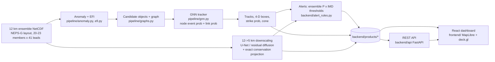

# SIH PS 26078: AI tracking of extreme-weather anomalies in ensemble forecasts + 12→5 km downscaling

This is a research prototype for MoES / NCMRWF. It takes a 12 km NEPS-G-style ensemble
(10-day, 6-hourly, India box 0–40° N, 60–100° E) and produces:
- z-score and EFI anomalies;
- a **GNN tracker** that links anomaly objects across leads and members;
- 4-D event boxes, strike probability and a consensus cone;
- **12→5 km downscaling** with exact conservation (U-Net and CorrDiff-style diffusion);
- **IMD-threshold alerts** (low / moderate / severe), served by a REST API and a React dashboard.

> Most training and TEST cases are **SYNTHETIC** events with exact ground truth, placed on real ERA5
> backgrounds. Real-data results (ERA5 vs IBTrACS / IMD) are labelled REAL wherever they appear.
> See `reports/RESULTS.md` for what works and what does not.

## Quick start

```bash
python -m venv .venv && .venv/Scripts/pip install -r requirements.txt   # Python 3.12, CPU
cd frontend && npm install && cd ..                                      # Node 24
python scripts/demo.py --case amphan     # one timed forecast cycle (~2 min CPU), then API + dashboard
```

- The dashboard opens at http://127.0.0.1:5173 and the API at http://127.0.0.1:8000
  (docs at `/docs`).
- `--skip-cycle` skips the timed cycle.
- `--static` serves the dependency-free BRIEF2 dashboard instead of the React one.
- If the API is down, the dashboard switches to **offline demo mode** and reads the precomputed
  files directly.

The git repo contains the precomputed products for a demo subset: `amphan_replay`, `cyc_04`,
`heat_04`, `cold_04` and `amphan_era5_real`. Rebuilding everything (data, models, products)
takes `make all` (or `python scripts/run_all.py all`) plus `python scripts/export_products.py`.

## Architecture



## Commands

| what | command |
|---|---|
| API | `python -m backend.api` |
| dashboard (dev) | `cd frontend && npm run dev` |
| export web products | `python scripts/export_products.py [case ...]` (`--grids-only`, `--restyle-strike`) |
| district raster | `python scripts/build_districts.py` (GADM 4.1 level 2) |
| results table | `python scripts/make_results.py` → `reports/RESULTS.md` |
| API latency + end-to-end | `python scripts/measure_perf.py` → `reports/SYSTEM_PERF.md` |
| tests | `python -m pytest -q` · `cd frontend && npm test && npx playwright test` |
| deliverable check | `python scripts/verify_deliverables.py` |

## Folder map

| path | contents |
|---|---|
| `pipeline/` | anomaly, EFI, trackers (baseline, v2, TE-style), GNN, downscaling, evaluation |
| `synth/` | synthetic event generator (Holland cyclones on IBTrACS tracks, heat domes, cold waves) |
| `scripts/` | data fetch, training, export, demo, reports, verifier |
| `backend/api/` | FastAPI app, product store, `POST /run` job runner |
| `backend/alert_rules.py` | IMD thresholds × ensemble probability → categories |
| `backend/products/` | precomputed web products per case (demo subset in git) |
| `backend/static/` | BRIEF2 static dashboard, India outline, GADM district outlines |
| `frontend/` | React + Vite + TypeScript dashboard (Operations, Downscaling, Alerts, Performance views) |
| `models/` | trained GNN tracker variants and downscalers |
| `reports/` | results (`RESULTS.md`, `GNN_RESULTS.md`, `DOWNSCALE_RESULTS.md`, `SYSTEM_PERF.md`, …) |
| `docs/` | `API.md`, `ALERT_RULES.md`, `COMPUTE.md`, `NEPS_G.md`, `PITCH.md` |
| `research/` | verified prior work (`PRIOR_WORK.md`) and the link check |
| `data/` | real data (ERA5, IBTrACS, IMD, DEM, boundaries) and synthetic cases (NetCDF not in git) |

## Honesty rules this repo follows
- Synthetic data is always flagged (`synthetic="true"`, and a SYNTHETIC badge in the UI).
- Every link in `research/` was fetched.
- Seeds are fixed.
- TEST cases are never used for tuning (`reports/TUNING_LOG.md`).
- Every report ends with "What did not work".
