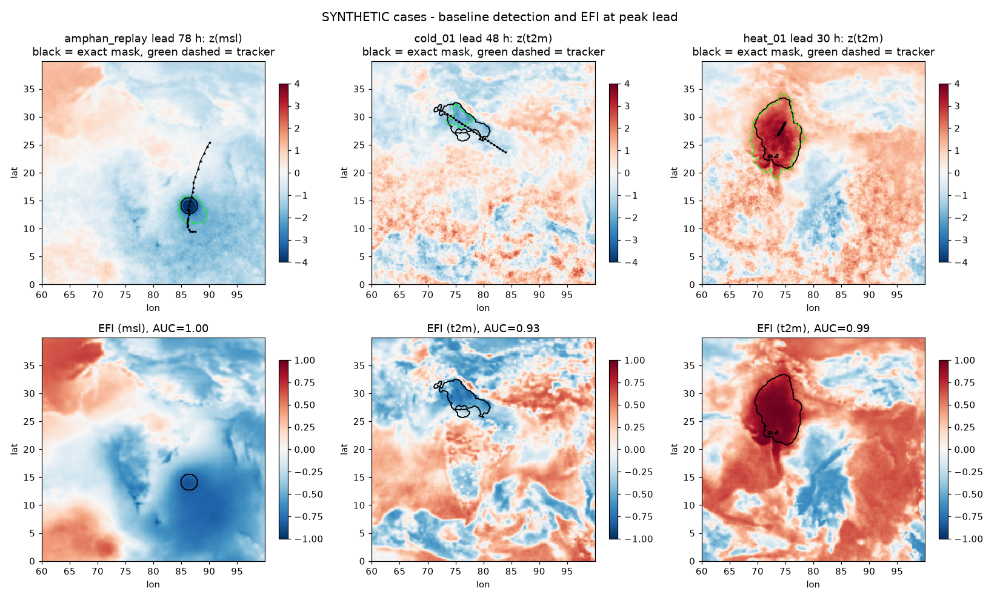
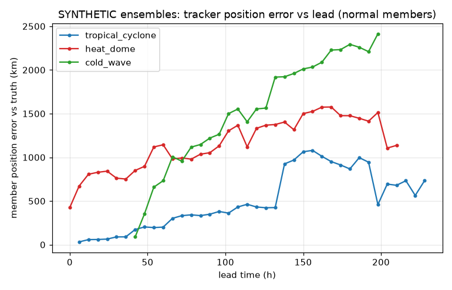
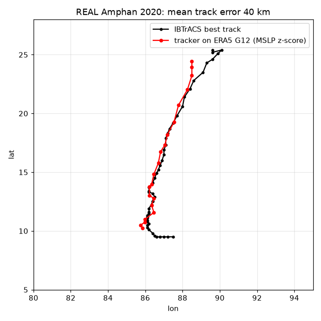

# Baseline results (Phase 5 smoke test)

Baseline = z-score anomaly vs ERA5 1990-2019 climatology -> threshold -> `scipy.ndimage.label` -> Hungarian frame-to-frame matching (`pipeline/track.py`), plus the ECMWF EFI (`pipeline/efi.py`). No learning is involved. All 12 km. z is smoothed with a 25 km Gaussian before thresholding. Thresholds: cyclone MSLP z <= -2.0, heat dome T2m z >= +1.75, cold wave T2m z <= -1.75; min object size 9 cells (cyclone) / 100 cells (heat, cold). These were set by hand once for all cases after a first look at heat_01, not tuned per case.

**Synthetic cases are SYNTHETIC** (exact labels). The Amphan row at the end is real ERA5 vs real IBTrACS.

## Synthetic cases: tracker on the 12 km truth (block-averaged 5 km truth)

| case | hazard | steps w/ event | IoU mean | IoU aggregate | centroid err mean (km) | median (km) | ens hit rate @peak | ens false-alarm tracks | EFI AUC @peak | EFI in mask | EFI outside |
|---|---|---|---|---|---|---|---|---|---|---|---|
| amphan_replay | tropical_cyclone | 24 | 0.34 | 0.15 | 8 | 6 | 0.65 | 470 | 1.00 | 0.83 | 0.20 |
| cold_01 | cold_wave | 15 | 0.22 | 0.25 | 331 | 395 | 0.15 | 533 | 0.93 | 0.54 | -0.03 |
| cold_02 | cold_wave | 23 | 0.17 | 0.24 | 167 | 130 | 0.05 | 490 | 0.91 | 0.45 | 0.00 |
| cold_03 | cold_wave | 19 | 0.18 | 0.19 | 169 | 143 | 0.25 | 522 | 0.99 | 0.77 | 0.02 |
| cold_04 | cold_wave | 27 | 0.17 | 0.17 | 341 | 114 | 0.05 | 653 | 0.87 | 0.59 | 0.12 |
| cyc_01 | tropical_cyclone | 32 | 0.70 | 0.76 | 8 | 7 | 0.40 | 365 | 0.95 | 0.56 | 0.17 |
| cyc_02 | tropical_cyclone | 22 | 0.26 | 0.45 | 7 | 5 | 0.00 | 491 | 0.46 | 0.18 | 0.16 |
| cyc_03 | tropical_cyclone | 21 | 0.61 | 0.68 | 12 | 12 | 0.05 | 446 | 0.86 | 0.49 | 0.04 |
| cyc_04 | tropical_cyclone | 35 | 0.35 | 0.39 | 10 | 8 | 0.25 | 439 | 0.98 | 0.47 | -0.11 |
| heat_01 | heat_dome | 29 | 0.49 | 0.53 | 193 | 189 | 0.30 | 803 | 0.99 | 0.91 | 0.23 |
| heat_02 | heat_dome | 25 | 0.06 | 0.10 | 118 | 116 | 0.05 | 831 | 0.56 | 0.44 | 0.33 |
| heat_03 | heat_dome | 19 | 0.42 | 0.44 | 141 | 141 | 0.30 | 777 | 0.99 | 0.86 | 0.28 |
| heat_04 | heat_dome | 35 | 0.27 | 0.29 | 140 | 138 | 0.00 | 764 | 0.71 | 0.45 | 0.16 |

EFI columns use sign-adjusted EFI (for cyclone MSLP and cold-wave T2m the EFI is negated so that 'more extreme' is positive).

## Summary by hazard

| hazard | n | IoU mean | centroid err (km) | EFI AUC |
|---|---|---|---|---|
| tropical_cyclone | 5 | 0.45 | 9 | 0.85 |
| heat_dome | 4 | 0.31 | 148 | 0.81 |
| cold_wave | 4 | 0.19 | 252 | 0.93 |

## Ensemble position error vs lead (normal members, mean over cases)

| lead (h) | tropical_cyclone | heat_dome | cold_wave |
|---|---|---|---|
| 24 | 64 | 841 | n/a |
| 72 | 332 | 993 | 956 |
| 120 | 431 | 1332 | 1554 |
| 168 | 951 | 1576 | 2228 |
| 240 | n/a | n/a | n/a |

## Real data: Amphan 2020, tracker on ERA5 G12 vs IBTrACS

- IBTrACS 6-hourly fixes inside the ERA5 window: 26; matched by tracker: 21
- Track error (km): mean 40, median 28, max 195

| time | ERA5 lat | ERA5 lon | IBTrACS lat | IBTrACS lon | error km | ERA5 min MSLP hPa | IBTrACS USA_PRES hPa |
|---|---|---|---|---|---|---|---|
| 2020-05-16 06:00:00 | 10.26 | 85.86 | 10.3 | 86.1 | 27 | 996.2 | 997 |
| 2020-05-16 12:00:00 | 10.50 | 85.74 | 10.6 | 86.2 | 51 | 989.4 | 992 |
| 2020-05-16 18:00:00 | 10.74 | 85.98 | 10.9 | 86.1 | 22 | 987.7 | 987 |
| 2020-05-17 00:00:00 | 10.98 | 85.98 | 11.2 | 86.1 | 28 | 979.8 | 982 |
| 2020-05-17 06:00:00 | 11.58 | 86.46 | 11.5 | 86.2 | 30 | 977.8 | 978 |
| 2020-05-17 12:00:00 | 12.18 | 86.34 | 11.9 | 86.2 | 35 | 974.6 | 970 |
| 2020-05-17 18:00:00 | 12.78 | 86.46 | 12.5 | 86.4 | 32 | 974.2 | 932 |
| 2020-05-18 00:00:00 | 13.02 | 86.22 | 13.2 | 86.4 | 28 | 967.3 | 919 |
| 2020-05-18 06:00:00 | 13.74 | 86.22 | 13.4 | 86.2 | 38 | 966.2 | 911 |
| 2020-05-18 12:00:00 | 13.98 | 86.34 | 14.1 | 86.4 | 15 | 959.6 | 901 |
| 2020-05-18 18:00:00 | 14.82 | 86.46 | 14.9 | 86.6 | 17 | 958.7 | 910 |
| 2020-05-19 00:00:00 | 15.78 | 86.70 | 15.6 | 86.8 | 23 | 950.8 | 925 |
| 2020-05-19 06:00:00 | 16.74 | 86.82 | 16.5 | 87.0 | 33 | 947.2 | 941 |
| 2020-05-19 12:00:00 | 17.34 | 87.06 | 17.3 | 87.1 | 6 | 952.1 | 946 |
| 2020-05-19 18:00:00 | 18.18 | 87.18 | 18.3 | 87.2 | 14 | 959.9 | 945 |
| 2020-05-20 00:00:00 | 19.26 | 87.54 | 19.2 | 87.5 | 8 | 961.4 | 947 |
| 2020-05-20 06:00:00 | 20.70 | 87.78 | 20.6 | 88.0 | 25 | 967.3 | 953 |
| 2020-05-20 12:00:00 | 22.02 | 88.26 | 22.1 | 88.4 | 17 | 970.7 | 954 |
| 2020-05-20 18:00:00 | 23.22 | 88.50 | 23.5 | 89.1 | 69 | 981.7 | 974 |
| 2020-05-21 00:00:00 | 23.94 | 88.50 | 24.6 | 89.6 | 133 | 986.9 | 984 |
| 2020-05-21 06:00:00 | 24.42 | 88.50 | 25.4 | 90.1 | 195 | 993.9 | 1000 |

## Reading these numbers

- The synthetic IoU/centroid numbers measure how well a *fixed-threshold* detector recovers an exactly known mask whose definition (physical-unit injected anomaly) differs from the detector's (z-score of the full field). They are a floor for the planned GNN tracker, not a skill claim.
- The synthetic backgrounds had real anomalies soft-clipped to 1.5 sigma, which makes detection easier than on raw ERA5; the Amphan-on-ERA5 row is the honest real-data check.
- Ensemble spread, 'miss' and 'false alarm' members were prescribed by the generator, so ensemble scores here test the pipeline plumbing, not forecast skill.
- **The per-member tracker is weak.** The generator adds large-scale background noise to each member (T2m up to ~1.5 K at 240 h), which creates many threshold exceedances. That produces hundreds of 'false-alarm tracks' per case, a low hit rate, and heat/cold member position errors of several hundred km even at short leads, because the 'main track' is sometimes a noise object and not the event. Fixed thresholds with largest-area track selection cannot separate them. This is exactly the gap the planned GNN tracker (learned, ensemble-aware) has to close. The EFI, which uses the whole ensemble at once, discriminates the events far better (AUC column).
