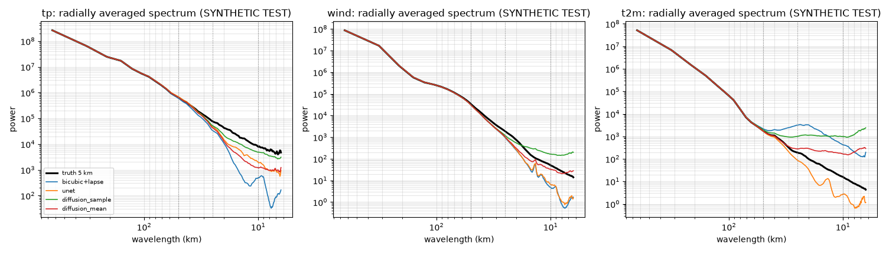
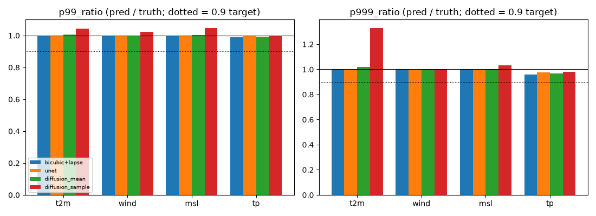
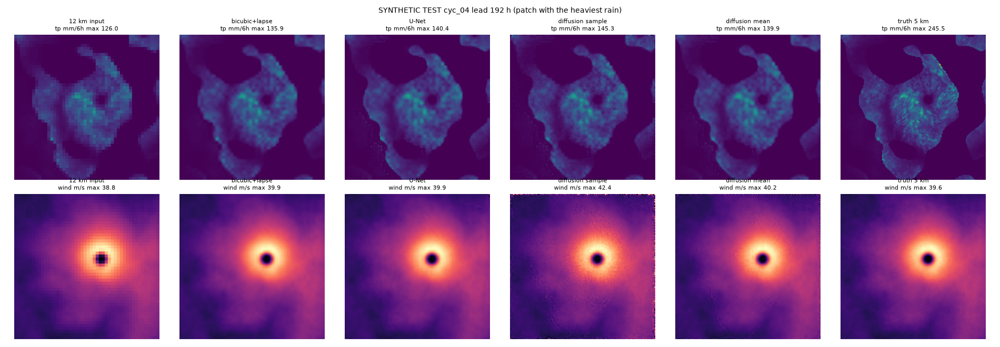

# Downscaling results (BRIEF4 Phase 0; completes BRIEF2 Phase 3)

The test set is the **SYNTHETIC** TEST cases cyc_04, heat_04, cold_04, amphan_replay, with exact 5 km truth. For each case it takes leads every 24 h and 8 patches per lead (48x48 cells at 12 km -> 144x144 at 5 km; half centred on the event, half random; fixed seed). Data are read from the full-precision NetCDF, and every model is scored on the same pixels. The models were trained on TRAIN patches and selected on VAL patches.

Diffusion: 8 DDIM samples (25 steps) per patch. `diffusion_mean` is their mean, re-projected; `diffusion_sample` is sample 1. The evaluation streams one case and one lead at a time, and its peak RSS was **643 MB** (the previous version was killed for lack of memory).

Ratio columns:
- For tp and wind: p99(pred) / p99(truth).
- For t2m and msl: (p99 - median) / (truth p99 - median).
- 1 is perfect; values below 1 mean the extremes were smoothed.

PSD ratio: power(pred) / power(truth) at that wavelength (below 1 means too smooth).

## t2m (degC)

| model | RMSE | MAE | CRPS | p99 ratio | p99.9 ratio | PSD 10 km | PSD 25 km | PSD 50 km | conservation err | min |
|---|---|---|---|---|---|---|---|---|---|---|
| bicubic+lapse | 0.610 | 0.263 | 0.263 | 1.000 | 1.000 | 26.937 | 17.548 | 1.272 | 9.3e-06 | -39.71 |
| unet | 0.122 | 0.089 | 0.089 | 0.999 | 1.000 | 0.177 | 0.442 | 0.957 | 8.1e-06 | -38.35 |
| diffusion_mean | 0.699 | 0.264 | 0.190 | 1.006 | 1.018 | 10.514 | 1.513 | 0.997 | 9.3e-06 | -51.56 |
| diffusion_sample | 1.826 | 0.610 | 0.610 | 1.043 | 1.330 | 62.595 | 5.567 | 1.135 | 8.5e-06 | -101.26 |

Diffusion ensemble: spread/skill = 2.571 (1 = well dispersed); rank histogram (9 bins) = [0.02, 0.063, 0.127, 0.187, 0.211, 0.185, 0.125, 0.062, 0.019].

## wind (m/s)

| model | RMSE | MAE | CRPS | p99 ratio | p99.9 ratio | PSD 10 km | PSD 25 km | PSD 50 km | conservation err | min | peak bias | peak ratio |
|---|---|---|---|---|---|---|---|---|---|---|---|---|
| bicubic+lapse | 0.188 | 0.139 | 0.139 | 1.000 | 0.997 | 0.095 | 0.491 | 0.896 | 0.0e+00 | 0.00 | -0.02 | 0.998 |
| unet | 0.215 | 0.147 | 0.147 | 1.000 | 0.998 | 0.131 | 0.516 | 0.901 | 0.0e+00 | 0.00 | 1.71 | 1.121 |
| diffusion_mean | 0.456 | 0.205 | 0.170 | 1.001 | 0.998 | 0.655 | 0.534 | 0.902 | 0.0e+00 | 0.00 | 7.22 | 1.511 |
| diffusion_sample | 1.245 | 0.373 | 0.373 | 1.024 | 1.003 | 3.285 | 0.637 | 0.901 | 0.0e+00 | 0.00 | 26.95 | 2.908 |

Diffusion ensemble: spread/skill = 1.968 (1 = well dispersed); rank histogram (9 bins) = [0.108, 0.112, 0.118, 0.121, 0.121, 0.115, 0.107, 0.101, 0.098].

## msl (hPa-1000)

| model | RMSE | MAE | CRPS | p99 ratio | p99.9 ratio | PSD 10 km | PSD 25 km | PSD 50 km | conservation err | min |
|---|---|---|---|---|---|---|---|---|---|---|
| bicubic+lapse | 0.066 | 0.049 | 0.049 | 1.000 | 1.000 | 0.200 | 0.516 | 0.937 | 1.0e-05 | -96.82 |
| unet | 0.074 | 0.052 | 0.052 | 1.001 | 1.000 | 0.299 | 0.541 | 0.941 | 1.1e-05 | -96.97 |
| diffusion_mean | 0.613 | 0.183 | 0.135 | 1.004 | 1.002 | 13.221 | 1.576 | 0.921 | 8.9e-06 | -99.51 |
| diffusion_sample | 1.634 | 0.439 | 0.439 | 1.048 | 1.031 | 73.984 | 5.438 | 0.932 | 8.5e-06 | -102.81 |

Diffusion ensemble: spread/skill = 2.650 (1 = well dispersed); rank histogram (9 bins) = [0.019, 0.063, 0.128, 0.189, 0.213, 0.186, 0.124, 0.06, 0.018].

## tp (mm/6h)

| model | RMSE | MAE | CRPS | p99 ratio | p99.9 ratio | PSD 10 km | PSD 25 km | PSD 50 km | conservation err | min | peak bias | peak ratio |
|---|---|---|---|---|---|---|---|---|---|---|---|---|
| bicubic+lapse | 1.577 | 0.352 | 0.352 | 0.988 | 0.957 | 0.064 | 0.436 | 0.925 | 1.6e-05 | 0.00 | -5.73 | 0.812 |
| unet | 1.674 | 0.396 | 0.396 | 0.996 | 0.977 | 0.245 | 0.622 | 1.077 | 2.1e-05 | 0.00 | -4.29 | 0.860 |
| diffusion_mean | 1.639 | 0.434 | 0.316 | 0.993 | 0.967 | 0.152 | 0.551 | 1.010 | 1.8e-05 | 0.00 | -3.99 | 0.869 |
| diffusion_sample | 1.995 | 0.616 | 0.616 | 1.001 | 0.978 | 0.614 | 0.675 | 1.013 | 2.0e-05 | 0.00 | 1.57 | 1.051 |

Diffusion ensemble: spread/skill = 0.738 (1 = well dispersed); rank histogram (9 bins) = [0.287, 0.038, 0.057, 0.081, 0.103, 0.113, 0.111, 0.106, 0.103]. For tp, ties at zero rain (truth = all samples = 0) count as rank 0, which inflates the first bin.

CRPS for the deterministic models (and for the single diffusion sample) is their MAE. The `diffusion_mean` row reports the CRPS of the 8-sample ensemble. Conservation error is max|avgpool(pred) - x12| (wind is not conserved, only its components are).

## Real data: IMD perfect-model test

PERFECT-MODEL test on REAL IMD 0.25 deg JJAS 2020 rain, coarsened 3x to 0.75 deg. Out of distribution: the models were trained at 12->5 km on synthetic mm/6h with all 5 variables; here only rain is given (other channels = training mean), in mm/day. Sea cells are excluded (set equal to the truth).

| model | RMSE (mm/day) | MAE | CRPS | p99 ratio | p99.9 ratio | min | peak ratio |
|---|---|---|---|---|---|---|---|
| bicubic+lapse | 4.36 | 0.99 | 0.99 | 0.854 | 0.842 | 0.00 | 0.625 |
| unet | 4.39 | 1.01 | 1.01 | 0.863 | 0.852 | 0.00 | 0.626 |
| diffusion_mean | 4.36 | 1.00 | 0.87 | 0.861 | 0.850 | 0.00 | 0.644 |
| diffusion_sample | 4.45 | 1.03 | 1.03 | 0.864 | 0.852 | 0.00 | 0.674 |

## Headline claim: diffusion keeps extremes where the U-Net smooths them

- Target: the diffusion p99 ratio (rain) is >= 0.9 and above the U-Net's. A contrast only counts if it exceeds 0.05.
- Result: diffusion sample 1.001, diffusion mean 0.993, U-Net 0.996, bicubic 0.988.
- **Verdict on SYNTHETIC TEST: the claim technically meets the threshold, but the claimed CONTRAST is NOT supported at p99.** The U-Net does not smooth p99 either. Pixel p99 over all patches is dominated by the 12 km amplitude, which the exact conservation projection preserves for every model, bicubic included.
- The contrast does show at small scales and in local peaks. Patch-peak rain ratio: diffusion sample 1.051 vs U-Net 0.860. 10 km rain power: 0.614 vs 0.245 of the truth. So diffusion keeps fine-scale texture and peaks, while the U-Net smooths them; p99 does not show it.

## What did not work

- Headline contrast at p99 not shown: the diffusion rain p99 ratio is 1.001 vs U-Net 0.996 (difference < 0.05). The advantage appears only in 10 km power and patch peaks.
- unet t2m: 10 km power is 0.18 of the truth (too smooth at small scales).
- unet wind: 10 km power is 0.13 of the truth (too smooth at small scales).
- unet msl: 10 km power is 0.30 of the truth (too smooth at small scales).
- unet tp: 10 km power is 0.25 of the truth (too smooth at small scales).
- Diffusion ensemble t2m: spread/skill 2.57 (outside 0.8-1.2, over-dispersed).
- Diffusion ensemble wind: spread/skill 1.97 (outside 0.8-1.2, over-dispersed).
- Diffusion ensemble msl: spread/skill 2.65 (outside 0.8-1.2, over-dispersed).
- Diffusion ensemble tp: spread/skill 0.74 (outside 0.8-1.2, under-dispersed).
- IMD perfect-model test: U-Net RMSE 4.39 > bicubic 4.36 mm/day (out of distribution).
- The heaviest-rain TEST patch (cyc_04, lead 192 h): the truth peak is 245.5 mm/6h, while every model stays near the 12 km-limited level (bicubic 135.9, U-Net 140.4, diffusion sample 145.3). Sub-grid peaks well above the 12 km value are not recovered.
- The diffusion sample shows noisy patch borders (the wind panel of ds4_example.png), a boundary artefact of padding-free patch sampling. Tiling with overlap would be needed at inference.

## Run

| case | patches | seconds | RSS (MB) |
|---|---|---|---|
| cyc_04 | 88 | 789.0 | 434.0 |
| heat_04 | 88 | 342.8 | 404.0 |
| cold_04 | 88 | 347.0 | 321.0 |
| amphan_replay | 88 | 300.9 | 326.0 |

Total 2130 s on torch 2.14.0+cpu on cpu (10 threads); peak RSS 643 MB.

