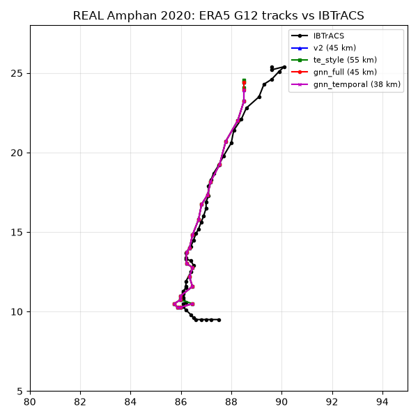
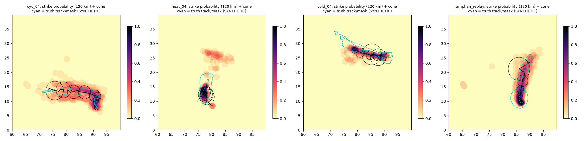
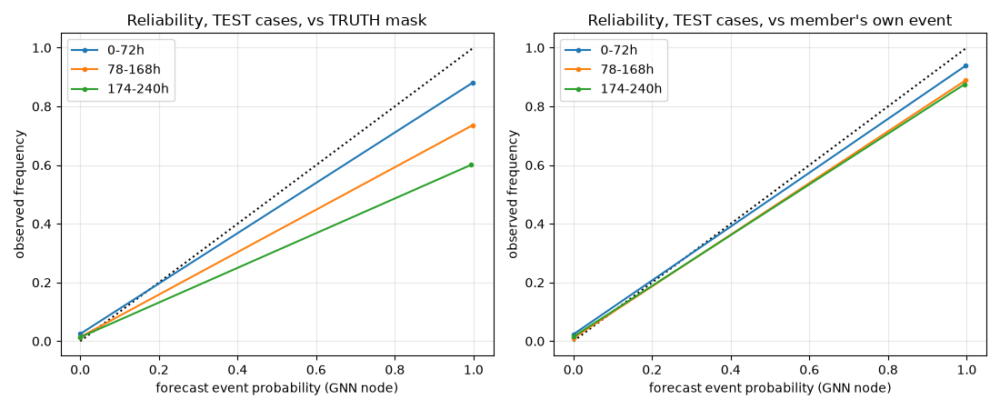

# GNN spatio-temporal tracker (BRIEF2 Phase 2)

Synthetic cases are **SYNTHETIC** (exact labels); the Amphan section is real ERA5 vs IBTrACS. The GNN was trained on the 6 TRAIN cases only, and its checkpoint and decoding thresholds were chosen on VAL (cyc_03, heat_03, cold_03). TEST (cyc_04, heat_04, cold_04, amphan_replay) is only reported.

Methods:
- **v2**: the Phase 1 tracker with its TRAIN+VAL parameters.
- **te_style**: TempestExtremes-style tracking (DetectNodes/StitchNodes for cyclones, DetectBlobs/StitchBlobs for heat/cold), re-implemented in `pipeline/te_style.py`.
- **gnn_\***: the GNN (`pipeline/gnn.py`), with edge-type ablations: full, temporal only, cross-member only, and none (a plain node MLP).

Metrics (see `pipeline/gnn_eval.py`):
- POD, FAR and CSI are over (member, lead) pairs, against the truth mask.
- Lag = hours after the truth onset until at least 50 % of members detect the event; lower is better. Lead gained = lag(v2) - lag(method).

## Mean over TEST cases

| method | IoU | CSI | POD | FAR | centroid err (km) | spurious tracks/case | mean lag (h) | lead gained vs v2 (h) |
|---|---|---|---|---|---|---|---|---|
| v2 | 0.17 | 0.32 | 0.48 | 0.58 | 725 | 15.5 | 0 (1 never) | 0 |
| te_style | 0.00 | 0.09 | 0.44 | 0.89 | 2599 | 176.8 | 14 (1 never) | -14 |
| gnn_full | 0.21 | 0.65 | 0.74 | 0.16 | 148 | 6.0 | 0 (0 never) | 0 |
| gnn_temporal | 0.21 | 0.66 | 0.74 | 0.15 | 154 | 2.5 | 4 (0 never) | 0 |
| gnn_cross | 0.20 | 0.62 | 0.71 | 0.19 | 122 | 5.2 | 10 (0 never) | 0 |
| gnn_none | 0.19 | 0.65 | 0.74 | 0.16 | 122 | 3.5 | 3 (0 never) | 0 |

## Mean over VAL cases

| method | IoU | CSI | POD | FAR | centroid err (km) | spurious tracks/case | mean lag (h) | lead gained vs v2 (h) |
|---|---|---|---|---|---|---|---|---|
| v2 | 0.40 | 0.55 | 0.83 | 0.37 | 106 | 7.7 | 2 (0 never) | 0 |
| te_style | 0.25 | 0.43 | 0.80 | 0.53 | 745 | 113.7 | 4 (0 never) | -2 |
| gnn_full | 0.19 | 0.76 | 0.82 | 0.10 | 146 | 1.0 | 4 (0 never) | -2 |
| gnn_temporal | 0.19 | 0.78 | 0.85 | 0.12 | 146 | 1.0 | 2 (0 never) | 0 |
| gnn_cross | 0.18 | 0.77 | 0.84 | 0.11 | 146 | 2.0 | 2 (0 never) | 0 |
| gnn_none | 0.18 | 0.76 | 0.86 | 0.15 | 146 | 5.0 | 0 (0 never) | 2 |

## Per case: TEST

| case | method | IoU | centroid err (km) | POD | FAR | CSI | spurious tracks | lag (h) |
|---|---|---|---|---|---|---|---|---|
| cyc_04 | v2 | 0.35 | 10 | 0.48 | 0.45 | 0.35 | 5 | 0 |
| cyc_04 | te_style | 0.00 | 3028 | 0.34 | 0.95 | 0.04 | 328 | 42 |
| cyc_04 | gnn_full | 0.10 | 10 | 0.61 | 0.19 | 0.53 | 1 | 0 |
| cyc_04 | gnn_temporal | 0.12 | 10 | 0.60 | 0.21 | 0.52 | 1 | 0 |
| cyc_04 | gnn_cross | 0.12 | 10 | 0.63 | 0.19 | 0.54 | 1 | 0 |
| cyc_04 | gnn_none | 0.11 | 10 | 0.61 | 0.21 | 0.53 | 3 | 0 |
| heat_04 | v2 | 0.00 | n/a | 0.02 | 0.96 | 0.01 | 27 | never |
| heat_04 | te_style | 0.00 | n/a | 0.04 | 0.93 | 0.03 | 24 | never |
| heat_04 | gnn_full | 0.47 | 129 | 0.70 | 0.25 | 0.57 | 23 | 0 |
| heat_04 | gnn_temporal | 0.46 | 123 | 0.68 | 0.15 | 0.61 | 8 | 18 |
| heat_04 | gnn_cross | 0.42 | 107 | 0.59 | 0.35 | 0.44 | 16 | 42 |
| heat_04 | gnn_none | 0.40 | 109 | 0.64 | 0.16 | 0.57 | 7 | 12 |
| cold_04 | v2 | 0.00 | 2159 | 0.62 | 0.70 | 0.25 | 27 | 0 |
| cold_04 | te_style | 0.00 | 2235 | 0.57 | 0.74 | 0.21 | 46 | 0 |
| cold_04 | gnn_full | 0.23 | 446 | 0.82 | 0.08 | 0.76 | 0 | 0 |
| cold_04 | gnn_temporal | 0.19 | 476 | 0.85 | 0.09 | 0.78 | 0 | 0 |
| cold_04 | gnn_cross | 0.22 | 363 | 0.82 | 0.07 | 0.77 | 0 | 0 |
| cold_04 | gnn_none | 0.22 | 363 | 0.87 | 0.12 | 0.78 | 0 | 0 |
| amphan_replay | v2 | 0.34 | 8 | 0.80 | 0.20 | 0.67 | 3 | 0 |
| amphan_replay | te_style | 0.00 | 2534 | 0.82 | 0.92 | 0.08 | 309 | 0 |
| amphan_replay | gnn_full | 0.03 | 8 | 0.82 | 0.14 | 0.73 | 0 | 0 |
| amphan_replay | gnn_temporal | 0.09 | 8 | 0.82 | 0.14 | 0.72 | 1 | 0 |
| amphan_replay | gnn_cross | 0.02 | 8 | 0.82 | 0.16 | 0.71 | 4 | 0 |
| amphan_replay | gnn_none | 0.03 | 8 | 0.82 | 0.16 | 0.71 | 4 | 0 |

## Per case: VAL

| case | method | IoU | centroid err (km) | POD | FAR | CSI | spurious tracks | lag (h) |
|---|---|---|---|---|---|---|---|---|
| cyc_03 | v2 | 0.61 | 12 | 0.65 | 0.35 | 0.48 | 3 | 0 |
| cyc_03 | te_style | 0.00 | 1959 | 0.65 | 0.95 | 0.05 | 322 | 0 |
| cyc_03 | gnn_full | 0.23 | 12 | 0.68 | 0.18 | 0.59 | 1 | 0 |
| cyc_03 | gnn_temporal | 0.23 | 12 | 0.70 | 0.21 | 0.59 | 3 | 0 |
| cyc_03 | gnn_cross | 0.23 | 12 | 0.69 | 0.21 | 0.58 | 4 | 0 |
| cyc_03 | gnn_none | 0.23 | 12 | 0.70 | 0.24 | 0.57 | 10 | 0 |
| heat_03 | v2 | 0.41 | 170 | 0.97 | 0.39 | 0.60 | 8 | 0 |
| heat_03 | te_style | 0.44 | 197 | 0.96 | 0.32 | 0.66 | 10 | 0 |
| heat_03 | gnn_full | 0.24 | 228 | 0.97 | 0.04 | 0.94 | 0 | 0 |
| heat_03 | gnn_temporal | 0.24 | 228 | 0.98 | 0.06 | 0.93 | 0 | 0 |
| heat_03 | gnn_cross | 0.24 | 228 | 0.97 | 0.05 | 0.93 | 0 | 0 |
| heat_03 | gnn_none | 0.24 | 228 | 0.98 | 0.09 | 0.90 | 1 | 0 |
| cold_03 | v2 | 0.18 | 136 | 0.88 | 0.38 | 0.57 | 12 | 6 |
| cold_03 | te_style | 0.30 | 80 | 0.77 | 0.32 | 0.57 | 9 | 12 |
| cold_03 | gnn_full | 0.09 | 198 | 0.82 | 0.09 | 0.75 | 2 | 12 |
| cold_03 | gnn_temporal | 0.08 | 198 | 0.88 | 0.09 | 0.81 | 0 | 6 |
| cold_03 | gnn_cross | 0.08 | 198 | 0.87 | 0.08 | 0.81 | 2 | 6 |
| cold_03 | gnn_none | 0.08 | 198 | 0.91 | 0.12 | 0.81 | 4 | 0 |

## Per case: TRAIN (in-sample for the GNN; not a skill estimate)

| case | method | IoU | centroid err (km) | POD | FAR | CSI | spurious tracks | lag (h) |
|---|---|---|---|---|---|---|---|---|
| cyc_01 | v2 | 0.70 | 8 | 0.66 | 0.34 | 0.49 | 5 | 0 |
| cyc_01 | te_style | 0.00 | 2841 | 0.60 | 0.93 | 0.07 | 300 | 24 |
| cyc_01 | gnn_full | 0.09 | 8 | 0.75 | 0.20 | 0.64 | 0 | 0 |
| cyc_01 | gnn_temporal | 0.08 | 9 | 0.75 | 0.20 | 0.63 | 0 | 0 |
| cyc_01 | gnn_cross | 0.08 | 9 | 0.75 | 0.20 | 0.63 | 2 | 0 |
| cyc_01 | gnn_none | 0.08 | 9 | 0.75 | 0.22 | 0.62 | 4 | 0 |
| cyc_02 | v2 | 0.26 | 7 | 0.29 | 0.59 | 0.20 | 7 | 42 |
| cyc_02 | te_style | 0.00 | 3101 | 0.48 | 0.96 | 0.04 | 307 | 0 |
| cyc_02 | gnn_full | 0.24 | 8 | 0.54 | 0.42 | 0.39 | 0 | 0 |
| cyc_02 | gnn_temporal | 0.24 | 8 | 0.53 | 0.42 | 0.38 | 1 | 0 |
| cyc_02 | gnn_cross | 0.24 | 8 | 0.54 | 0.43 | 0.38 | 5 | 0 |
| cyc_02 | gnn_none | 0.24 | 8 | 0.53 | 0.43 | 0.38 | 5 | 0 |
| heat_01 | v2 | 0.50 | 70 | 0.96 | 0.22 | 0.76 | 3 | 0 |
| heat_01 | te_style | 0.62 | 66 | 0.92 | 0.24 | 0.71 | 4 | 0 |
| heat_01 | gnn_full | 0.38 | 69 | 0.95 | 0.04 | 0.91 | 0 | 0 |
| heat_01 | gnn_temporal | 0.38 | 69 | 0.95 | 0.04 | 0.92 | 0 | 0 |
| heat_01 | gnn_cross | 0.38 | 66 | 0.96 | 0.07 | 0.90 | 0 | 0 |
| heat_01 | gnn_none | 0.38 | 66 | 0.96 | 0.03 | 0.93 | 0 | 0 |
| heat_02 | v2 | 0.10 | 220 | 0.89 | 0.35 | 0.60 | 11 | 0 |
| heat_02 | te_style | 0.24 | 157 | 0.84 | 0.39 | 0.55 | 13 | 0 |
| heat_02 | gnn_full | 0.04 | 455 | 0.90 | 0.03 | 0.88 | 0 | 0 |
| heat_02 | gnn_temporal | 0.04 | 455 | 0.89 | 0.03 | 0.87 | 0 | 0 |
| heat_02 | gnn_cross | 0.04 | 455 | 0.90 | 0.07 | 0.84 | 0 | 0 |
| heat_02 | gnn_none | 0.04 | 455 | 0.88 | 0.07 | 0.82 | 0 | 0 |
| cold_01 | v2 | 0.31 | 258 | 0.87 | 0.33 | 0.61 | 4 | 0 |
| cold_01 | te_style | 0.28 | 256 | 0.67 | 0.23 | 0.56 | 2 | 0 |
| cold_01 | gnn_full | 0.27 | 261 | 0.86 | 0.02 | 0.84 | 0 | 0 |
| cold_01 | gnn_temporal | 0.28 | 261 | 0.89 | 0.09 | 0.82 | 0 | 0 |
| cold_01 | gnn_cross | 0.27 | 261 | 0.91 | 0.07 | 0.86 | 0 | 0 |
| cold_01 | gnn_none | 0.27 | 261 | 0.91 | 0.18 | 0.76 | 3 | 0 |
| cold_02 | v2 | 0.11 | 417 | 0.54 | 0.53 | 0.34 | 14 | 48 |
| cold_02 | te_style | 0.07 | 233 | 0.42 | 0.61 | 0.25 | 15 | 66 |
| cold_02 | gnn_full | 0.22 | 253 | 0.84 | 0.09 | 0.78 | 1 | 0 |
| cold_02 | gnn_temporal | 0.21 | 253 | 0.84 | 0.14 | 0.74 | 3 | 0 |
| cold_02 | gnn_cross | 0.22 | 253 | 0.85 | 0.07 | 0.80 | 2 | 0 |
| cold_02 | gnn_none | 0.22 | 268 | 0.86 | 0.11 | 0.77 | 3 | 0 |

## Real Amphan 2020 (ERA5 G12 vs IBTrACS)

| method | matched 6-h fixes | mean err (km) | median (km) | max (km) | other tracks |
|---|---|---|---|---|---|
| v2 | 23 | 45 | 28 | 195 | 0 |
| te_style | 25 | 55 | 30 | 216 | 22 |
| gnn_full | 23 | 45 | 28 | 195 | 0 |
| gnn_temporal | 22 | 38 | 28 | 133 | 0 |
| gnn_cross | 22 | 38 | 28 | 133 | 2 |
| gnn_none | 22 | 38 | 28 | 133 | 0 |

ERA5 is a single deterministic run, so the GNN sees no cross-member edges; the temporal-only variant is the like-for-like model here.

## Ensemble products (TEST cases, full GNN)

Reliability is computed from the GNN node event probabilities of all TEST ensemble nodes, binned by lead. The left panel verifies against the truth mask; the right verifies against the member's own injected event, which is the GNN's training target.

## Training

| variant | best epoch | val AP node+edge | train time (s) | compute |
|---|---|---|---|---|
| full | 149 | 1.948 | 417 | torch 2.14.0+cpu on cpu (10 threads) |
| temporal | 104 | 1.950 | 348 | torch 2.14.0+cpu on cpu (3 threads) |
| cross | 48 | 1.940 | 455 | torch 2.14.0+cpu on cpu (3 threads) |
| none | 42 | 1.944 | 154 | torch 2.14.0+cpu on cpu (3 threads) |

Decoding thresholds (chosen on VAL, full model): `{"tropical_cyclone": {"tau_n": 0.5, "tau_e": 0.5, "min_len": 2}, "heat_dome": {"tau_n": 0.3, "tau_e": 0.5, "min_len": 2}, "cold_wave": {"tau_n": 0.3, "tau_e": 0.5, "min_len": 2}}`

The GNN's main track is the one with the largest summed node event probability. This was changed from the largest-area rule after VAL cyc_03 showed the area rule picking a large non-storm object (truth-run IoU 0.00 -> 0.23); TEST numbers were not looked at for this.

## Findings (honest reading)

- **Detection skill.** On TEST, gnn_full has CSI 0.65 against 0.32 for v2 and 0.09 for TE-style, and FAR 0.16 against 0.58. It detects the two TEST events that v2 misses entirely (heat_04, where the IMD 40 C rule never fires, and cold_04). The same ranking holds on VAL.
- **Area overlap is worse.** Truth-run IoU is 0.19 for the GNN against 0.40 for v2 on VAL, and 0.21 against 0.17 on TEST. The GNN classifies and links the permissive candidate objects but does not re-segment them, and those objects are larger than the exact masks. A segmentation head is future work.
- **Edges add little.** All four variants have VAL AP 1.94-1.95 of 2, and the node-only MLP (gnn_none) matches the full GNN on TEST CSI. Most of the signal is in the node features (intensity, IMD-criteria fraction, EFI, shape). On TEST, cross-member edges do not help, and temporal edges give the fewest spurious tracks. With 6 training cases, the edge types cannot be ranked reliably.
- **Real Amphan.** The temporal-only GNN gives 38 km mean error against 45 km for v2 and 55 km for TE-style. The median is 28 km for all three, so the gain comes from fewer bad fixes (max 133 km against 195 km). The full GNN scores exactly like v2 here (same matched fixes and errors). A likely but unverified reason: a single ERA5 run has none of the cross-member edges the full model was trained with.
- **Time to detection.** The mean lag is 0-10 h and no GNN variant misses a TEST event. The 'lead gained vs v2' column only averages cases both methods detect; v2 never detects heat_04 at all.
- **Probabilities are over-confident.** GNN node probabilities are nearly binary. Against the member's own event they are close to calibrated. Against the truth, p ~ 1 verifies about 60-90 % of the time, with the long-lead bin worst, because the model was trained to recognise events in each member, not to forecast the truth. Lead-dependent calibration on VAL (e.g. temperature scaling) is a cheap next step.
- **TE-style is poor on cyclones.** Without the warm-core and wind criteria that real TempestExtremes setups add, MSLP minima with a closed contour include many weak lows, giving hundreds of spurious tracks per case. It is a like-for-like re-implementation of the DetectNodes/StitchNodes core, not an optimised TE configuration.

