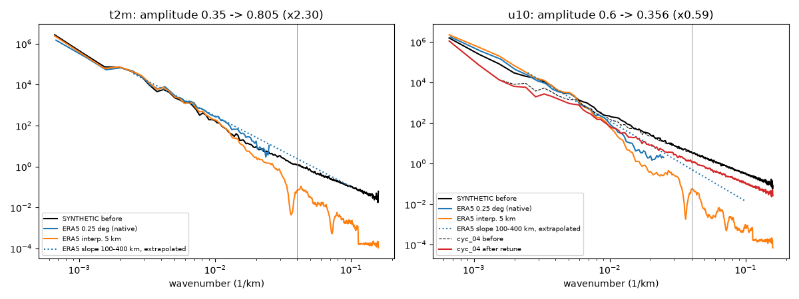

# Physics-informed downscaling (BRIEF4 Phase 4)

SYNTHETIC TEST patches (same sampling as reports/DOWNSCALE_RESULTS.md) and the REAL IMD perfect-model check. Physics weights of `unet_phys` (chosen on VAL, see reports/TUNING_LOG.md): {'rain': 0.005}. The hard conservation projection is unchanged for every model.

## Physics-violation rate (% of the relevant cells), SYNTHETIC TEST

| model | rain where convergence <= 0 | wind divergence > truth p99.9 | lapse-rate wrong sign | rain < 0 | q <= q_sat |
|---|---|---|---|---|---|
| truth | 45.41 | 0.33 | 8.32 | 0.00 | n/a |
| bicubic+lapse | 45.46 | 0.26 | 0.92 | 0.00 | n/a |
| unet | 45.37 | 0.40 | 8.61 | 0.00 | n/a |
| diffusion_sample | 45.42 | 5.52 | 15.84 | 0.00 | n/a |
| unet_phys | 45.38 | 0.39 | 8.54 | 0.00 | n/a |
| diffusion_phys_sample | 45.45 | 5.52 | 15.68 | 0.00 | n/a |

Definitions: rain_noconv: % of wet cells (tp > 1 mm/6h) with convergence <= 0; div: % of cells with |div V10| > truth p99.9; lapse: % of cells with |dz'| > 200 m where T2m's sub-grid anomaly has the wrong sign (> 0.5 K); neg_rain: % of cells with rain < 0. The convergence is a proxy (-div of the 12 km 10 m wind; the downscaler has no humidity or 850 hPa wind), so even the synthetic TRUTH 'violates' it where rain was placed by 850 hPa moisture-flux convergence. q <= q_sat cannot be violated because humidity is not a downscaled variable (pipeline/physics.py has qsat for when it is).

## Cost of the constraints (SYNTHETIC TEST)

| model | rain RMSE | rain p99 ratio | rain patch-peak ratio | rain 10 km power | wind 10 km power | t2m RMSE |
|---|---|---|---|---|---|---|
| bicubic+lapse | 1.577 | 0.988 | 0.812 | 0.064 | 0.095 | 0.610 |
| unet | 1.674 | 0.996 | 0.860 | 0.245 | 0.131 | 0.122 |
| diffusion_sample | 1.994 | 1.001 | 1.053 | 0.604 | 3.324 | 1.823 |
| unet_phys | 1.575 | 0.995 | 0.899 | 0.266 | 0.128 | 0.119 |
| diffusion_phys_sample | 1.935 | 1.000 | 1.075 | 0.607 | 3.404 | 1.821 |

## REAL IMD perfect-model check (rain only)

| model | rain where convergence <= 0 | rain < 0 |
|---|---|---|
| bicubic+lapse | 52.55 | 0.00 |
| unet | 52.63 | 0.00 |
| diffusion_sample | 52.40 | 0.00 |
| unet_phys | 52.11 | 0.00 |
| diffusion_phys_sample | 52.68 | 0.00 |
| truth | 52.13 | 0.00 |

Only rain is given in this test (winds = training mean), so the convergence proxy carries no information here and the rain-without-convergence rate is not meaningful; it is shown for completeness.

## Crop-aware inference

Downscaling only the tracker's 4-D box + 100 km (116 x 164 cells at 12 km, 17 % of the domain) instead of the full 336 x 336: **0.185 s vs 1.144 s (83.8 % less time)**, peak process memory 426 MB vs 1194 MB (of which ~282 MB is Python + torch + the model; U-Net, cyc_04 member 0, one lead, best of 3 fresh processes).

## Retuning the synthetic fine-scale noise (scripts/retune_noise.py)

Reference: ERA5's native 0.25 deg spectrum fitted over 100-400 km (the scales ERA5 resolves) and extrapolated to 25 km (ERA5 interpolated to 5 km has almost no 25 km power, so it cannot be the target; there is no real km-scale product here). New amplitude A solves P_background + A^2 P_unit-noise = P_ref at 25 km.

| variable | reference case | ERA5 slope 100-400 km | synthetic / reference power at 25 km (before) | amplitude before -> after |
|---|---|---|---|---|
| t2m | heat_01 | -3.45 | 0.51 | 0.35 -> 0.805 (x2.30) |
| u10 | amphan_replay | -3.95 | 7.32 | 0.6 -> 0.356 (x0.59) |

Regenerated TEST cases (retuned copies in data/synthetic_retuned; the originals, and every model trained on them, are unchanged):

| case | variable | power at 25 km before -> after | power at 50 km before -> after | reference at 25 km |
|---|---|---|---|---|
| heat_04 | t2m | 1.07 -> 5.64 | 8.41 -> 41.88 | 2.45 |
| cyc_04 | u10 | 3.50 -> 1.25 | 23.17 -> 8.14 | 0.52 |

The earlier statement that synthetic fine scales carry ~19x ERA5's power at 25 km compared against ERA5 *interpolated* to 5 km. Against ERA5's own extrapolated slope, synthetic t2m was too WEAK (x0.5) and u10 too strong (x7). The one-shot retune overshoots for t2m (the fine noise is not the only small-scale source in the generator: event shapes and the DEM term add power), so it is a direction, not a finished calibration.

## What did not work

- rain without convergence: the physics U-Net does not reduce violations (45.38 % vs 45.37 %).
- q <= q_sat is not applicable (no humidity output); the moisture-convergence term uses a 10 m-wind proxy.
- The diffusion residual model was NOT retrained with the physics loss (CPU budget); diffusion+physics = the same sampler on the physics-fine-tuned mean.
- Synthetic data regenerated with the retuned noise for 2 TEST cases only; the 13-case dataset and the models were not regenerated / retrained (several CPU-hours), so BRIEF Phase 4 and BRIEF4 Phase 0 were not re-run on retuned data. The retune itself overshoots t2m and leaves u10 ~2.4x above the reference.
