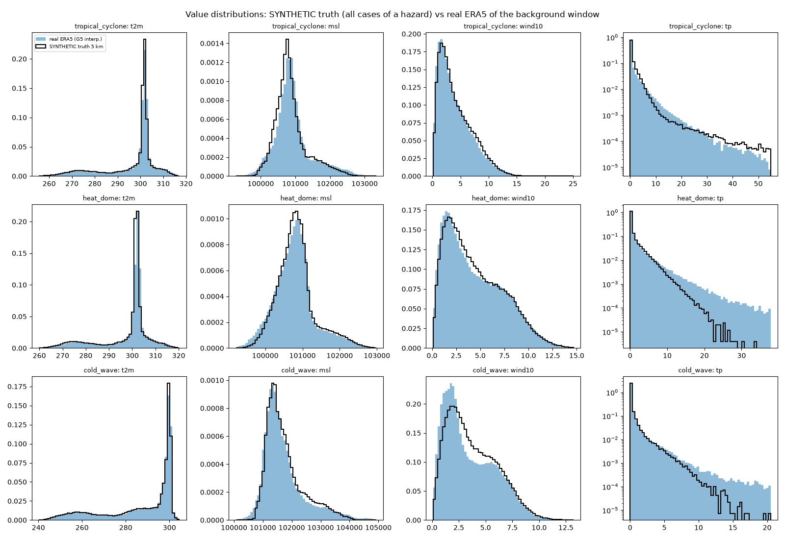
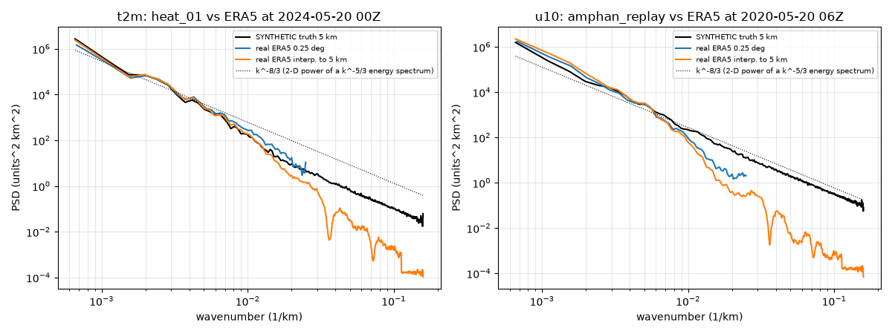
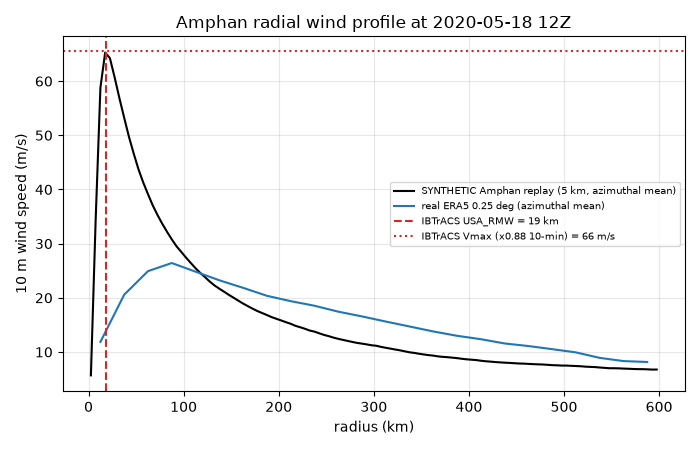

# Synthetic-data realism check (Phase 4)

Everything labelled SYNTHETIC below was produced by `synth/` and is **not** an observation or a real forecast. Real references: ERA5 (WeatherBench 2 / ARCO-ERA5), IMD 0.25 deg gridded rainfall (imdlib), IBTrACS v04r01.

## 1. Value distributions and 99th percentiles

Synthetic: 5 km truth of all cases of a hazard (every 3rd 6-h step, so all synoptic hours are sampled). Real: ERA5 of the same background window interpolated to the same 5 km grid (every 3rd step), whole India box.

| hazard | variable | unit | synthetic p50 | real p50 | synthetic p99 | real p99 | synthetic max | real max |
|---|---|---|---|---|---|---|---|---|
| tropical_cyclone | t2m | K | 301.33 | 301.47 | 312.89 | 313.91 | 318.78 | 318.85 |
| tropical_cyclone | msl | Pa | 100787.00 | 100847.00 | 102355.00 | 102643.01 | 103242.00 | 103948.00 |
| tropical_cyclone | wind10 | m/s | 3.46 | 3.30 | 12.75 | 13.12 | 60.41 | 30.65 |
| tropical_cyclone | tp | mm/6h | 0.18 | 0.02 | 12.36 | 15.01 | 159.94 | 162.99 |
| heat_dome | t2m | K | 301.59 | 301.92 | 315.36 | 315.70 | 323.52 | 322.91 |
| heat_dome | msl | Pa | 100796.00 | 100777.00 | 102400.00 | 102444.00 | 103276.00 | 104046.00 |
| heat_dome | wind10 | m/s | 3.89 | 3.80 | 11.92 | 12.08 | 20.76 | 21.97 |
| heat_dome | tp | mm/6h | 0.12 | 0.08 | 8.86 | 14.94 | 33.58 | 230.12 |
| cold_wave | t2m | K | 296.02 | 296.19 | 301.51 | 302.07 | 305.77 | 306.63 |
| cold_wave | msl | Pa | 101574.00 | 101519.00 | 103723.00 | 104135.01 | 105173.00 | 105791.00 |
| cold_wave | wind10 | m/s | 3.35 | 2.84 | 9.61 | 9.40 | 17.61 | 15.54 |
| cold_wave | tp | mm/6h | 0.00 | 0.00 | 4.02 | 5.56 | 22.24 | 118.20 |

### Daily rainfall over land vs IMD

| source | p99 (mm/day) | p99.9 (mm/day) | max (mm/day) |
|---|---|---|---|
| IMD 0.25 deg (real), 2020-05-10..25 | 43.5 | 138.6 | 318.2 |
| SYNTHETIC amphan_replay (12 km, daily, land) | 25.0 | 81.9 | 214.7 |
| SYNTHETIC cyc_01 (12 km, daily, land) | 30.5 | 111.0 | 316.7 |
| SYNTHETIC cyc_02 (12 km, daily, land) | 21.7 | 61.5 | 157.4 |
| SYNTHETIC cyc_03 (12 km, daily, land) | 22.0 | 73.6 | 338.0 |
| SYNTHETIC cyc_04 (12 km, daily, land) | 24.8 | 102.8 | 296.7 |
| ERA5 G12 (real), 2020-05-10..25, daily, land | 29.2 | 85.5 | 153.8 |

### Cyclone rain swath vs IMD Amphan (calibration target)

Daily land rain within 500 km of the storm centre, ~0.25 deg, wet cells (>= 1 mm/day). Cyclone rain is quantile-mapped to IMD Amphan (`synth/rain_qm.json`, fitted on the TRAIN cases cyc_01 and cyc_02 only). Target: p99 within 20 % of IMD.

| sample | n | p50 | p90 | p99 | p99 vs IMD | p99.9 | max |
|---|---|---|---|---|---|---|---|
| IMD Amphan 2020 (real) | 662 | 22.4 | 94.6 | 188.1 | +0 % | 219.4 | 229.6 |
| amphan_replay | 1350 | 27.7 | 79.2 | 127.7 | -32 % | 158.6 | 166.4 |
| cyc_01 | 1675 | 31.0 | 97.1 | 200.4 | +7 % | 250.0 | 272.1 |
| cyc_02 | 1489 | 20.8 | 58.6 | 95.5 | -49 % | 120.7 | 134.4 |
| cyc_03 | 2382 | 9.4 | 53.3 | 149.2 | -21 % | 202.3 | 271.2 |
| cyc_04 | 1799 | 23.4 | 83.9 | 175.6 | -7 % | 230.2 | 235.7 |

## 2. Radially averaged power spectra

| variable | case / time | slope 20-200 km, SYNTHETIC | slope 20-200 km, ERA5 interp. 5 km | power ratio syn/ERA5-interp at 25 km |
|---|---|---|---|---|
| t2m | heat_01 2024-05-20 00:00:00 | -3.48 | -5.48 | 19.2 |
| u10 | amphan_replay 2020-05-20 06:00:00 | -3.05 | -5.33 | 69.6 |

A k^-5/3 energy spectrum corresponds to a 2-D power slope of about -8/3 = -2.67.

## 3. Cyclone radial wind profile vs Amphan observations

At the synthetic replay's peak (2020-05-18 12:00:00, lead 78 h):

| quantity | SYNTHETIC replay | IBTrACS (real) | ERA5 0.25 deg (real) |
|---|---|---|---|
| Vmax, azimuthal mean (m/s) | 65.3 | 65.6 (USA_WIND 145 kt 1-min x 0.88) | 26.4 |
| Vmax, grid point (m/s) | 70.4 | - | 29.2 |
| radius of max wind (km) | 18 | 19 (USA_RMW) | 88 |

## 4. Heat-wave / cold-wave magnitude vs IMD criteria

IMD plains criteria: heat wave if Tmax departure >= 4.5 C (severe >= 6.5 C) and Tmax >= 40 C; cold wave if Tmin departure <= -4.5 C (severe <= -6.5 C) and Tmin <= 10 C. Here Tmax/Tmin are taken from the four 6-hourly 12 km truth values of the most extreme day, and departures are relative to the ERA5 1990-2019 climatology (not IMD station normals). Fractions are over the cells inside the exact event mask.

| case | peak day | injected peak (K) | mean departure (C) | extreme departure (C) | frac >= 4.5 C | frac >= 6.5 C | frac meeting absolute threshold | frac meeting IMD (both) |
|---|---|---|---|---|---|---|---|---|
| cold_01 | 2022-12-23 | 5.60 | -4.02 | -7.04 | 0.41 | 0.02 | 0.96 | 0.41 |
| cold_02 | 2023-01-01 | 7.04 | -3.74 | -6.22 | 0.28 | 0.00 | 0.98 | 0.28 |
| cold_03 | 2023-01-06 | 4.86 | -5.89 | -7.51 | 0.97 | 0.20 | 1.00 | 0.97 |
| cold_04 | 2023-01-10 | 6.25 | -4.13 | -7.09 | 0.38 | 0.05 | 1.00 | 0.38 |
| heat_01 | 2024-05-20 | 7.96 | 7.01 | 10.43 | 0.99 | 0.61 | 0.92 | 0.91 |
| heat_02 | 2024-05-29 | 5.38 | 6.69 | 9.11 | 1.00 | 0.47 | 0.92 | 0.92 |
| heat_03 | 2024-05-31 | 7.12 | 6.93 | 10.16 | 0.94 | 0.66 | 0.81 | 0.81 |
| heat_04 | 2024-06-13 | 6.15 | 4.48 | 7.30 | 0.51 | 0.04 | 0.00 | 0.00 |

Real reference: ERA5 2024 heatwave, NW-India box (24-31N, 70-80E), peak day 2024-05-27: box-mean Tmax departure 5.85 C, box-mean Tmax 44.44 C (6-hourly sampling).

## 5. Where the synthetic data is NOT realistic

- **Small scales are statistical, not dynamical.** The fine structure below ~50 km is spectral noise (k^-5/3) plus the DEM rain factor. It has 19x the 25 km power of interpolated ERA5, because ERA5 has almost none at that scale. Nothing ties it to the weather: no fronts, no sea-breeze, no convection organisation. Validate against a real km-scale product (e.g. IMD 0.0625 deg or a convection-permitting model) before trusting it.
- **Backgrounds are tamed on purpose.** Real ERA5 anomalies are soft-clipped to 1.5 sigma and the real Amphan vortex is smoothed away. As a result the tails of t2m/msl/tp in the background are lighter than in reality, and in the tables above most of the heavy tail comes from the injected event.
- **The cyclone is an analytic, symmetric Holland vortex** plus a motion asymmetry and log-spiral bands. There are no eyewall replacement cycles, no shear-induced asymmetry and no wind-pressure-rain coupling beyond the parametrisation. At peak the replay's azimuthal-mean Vmax is 65 m/s (IBTrACS 10-min equivalent 66 m/s) and its RMW is 18 km (IBTrACS 19 km). ERA5 itself only reaches 26 m/s, so the synthetic winds are far stronger than anything a 0.25 deg reanalysis or a 12 km global EPS will show.
- **Rain amounts are parametric; local maxima are now close to IMD.** The eyewall peak rate is 3 + 0.3*Vmax mm/h, gated by 850 hPa moisture-flux convergence, scaled by the upslope factor (<= 2x) and quantile-mapped to IMD Amphan (fitted on 2 train cases). The 6-h maximum is 160 mm against 163 mm in ERA5, and the daily land maxima reach up to 338 mm/day against 318 mm/day in IMD (May 2020); the swath table above has the calibrated comparison. Calibrating every storm to one storm (Amphan) is itself an assumption. The gating uses ERA5 850 hPa moisture and winds (Amphan window only). Heat and cold cases inject no rain; they only damp the background.
- **Heat domes and cold waves are 2-D surface blobs.** They have no vertical structure (the 4-D box level range is surface-only), and their wind response is a geostrophic increment times 0.6. There is no soil-moisture feedback. The diurnal cycle is a fixed +/-20 % modulation, not the observed Tmax/Tmin asymmetry.
- **IMD criteria are only partly met.** Across the heat cases, on average 66 % of mask cells meet the full IMD heat-wave definition (departure plus the 40 C absolute threshold) on the peak day. 6-hourly sampling misses the true Tmax, and ERA5 climatology is not the IMD normal.
- Across the cold-wave cases, 51 % of mask cells meet the IMD cold-wave definition (departure plus Tmin <= 10 C).
- **Departures are larger than the injected amplitude.** In the heat cases the departure from climatology exceeds the injected peak (mean departure vs. injected peak in the table above). The real 2024 heatwave background, even soft-clipped to 1.5 sigma (~+4 K), adds to the injected dome. The exact label is the injected part only, so a detector that sees the full anomaly will find a larger event than the label.
- **Ensembles are not a model.** Members are the truth event with prescribed, lead-dependent position and intensity errors, 2 'miss' and 1-2 'false alarm' members, and large-scale noise. Their spread-skill relation is built in, not emergent.
- **Grid.** G5 is 0.04 deg (~4.4 km) rather than 0.045 deg, so that 3x3 block averaging onto the 0.12 deg grid is exact.